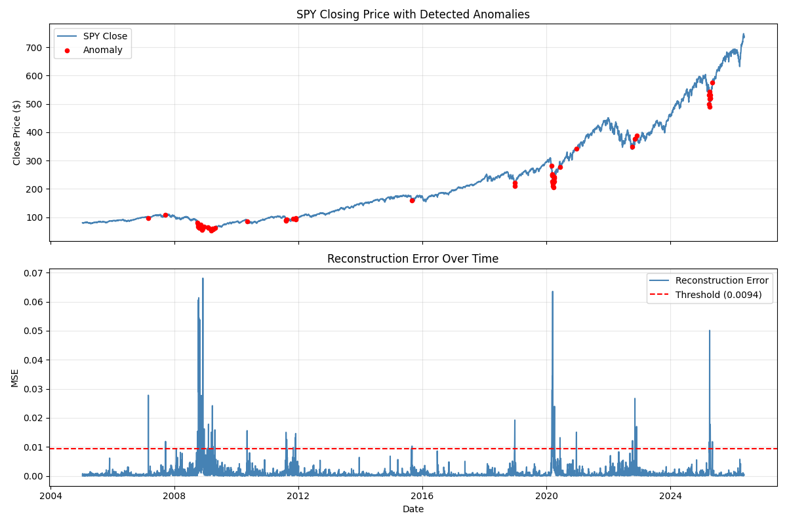

# SPY Anomaly Detection

This project uses an autoencoder neural network to detect anomalous trading days in SPY (S&P 500 ETF) data from 2005 to present. The model is trained only on pre-2020 data to learn normal market behavior, then scores every day by reconstruction error to flag outliers.

## How It Works

The pipeline works in five stages:

1. **Feature engineering** — Daily OHLCV data from Yahoo Finance is transformed into four features: daily return (day-over-day change in close price), 7-day rolling volatility of returns, day-over-day volume change, and high-low spread relative to close.
2. **Autoencoder architecture** — A symmetric encoder-decoder compresses the 4 features through hidden layers (4 → 16 → 8 → 2) and reconstructs them (2 → 8 → 16 → 4), with a 2-unit bottleneck that captures normal market patterns.
3. **Training on normal data only** — The model is fit exclusively on pre-2020 rows so it learns typical market dynamics without recent crisis regimes in the training set.
4. **Anomaly scoring** — Every day (train and test combined) is passed through the trained model; per-day mean squared reconstruction error measures how poorly the model reproduces that day's features.
5. **Thresholding** — Days whose error exceeds the 99th percentile of training-set errors are flagged as anomalies.

## Results

The model detected anomalies corresponding to: the 2008 financial crisis (highest reconstruction error in the dataset), the 2010 Flash Crash, the 2020 COVID crash, the 2022 Fed rate hike selloff, and 2025 tariff-driven volatility.



## Project Structure

```
anomaly-detection/
├── .gitignore
├── README.md
├── requirements.txt
├── data/
│   └── .gitkeep
├── models/
│   ├── .gitkeep
│   ├── autoencoder.pth
│   ├── loss_curve.png
│   └── anomaly_plot.png
└── src/
    ├── __init__.py
    ├── model.py
    ├── preprocess.py
    ├── train.py
    └── evaluate.py
```

## How To Run

1. Clone the repo
2. `pip install -r requirements.txt`
3. `python src/preprocess.py`
4. `python src/train.py`
5. `python src/evaluate.py`

## Tech Stack

- Python, PyTorch, yfinance, scikit-learn, pandas, numpy, matplotlib
